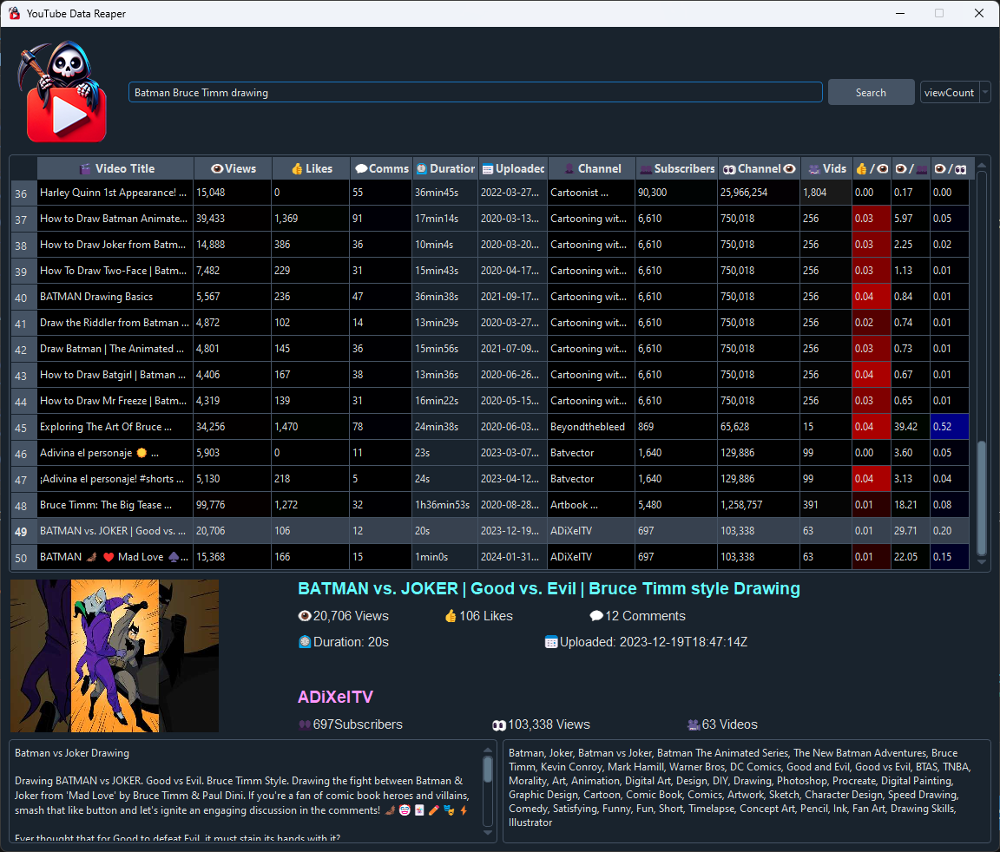

# YouTube Data Reaper
<p align="center">
  
</p>

Ever got the feeling that YouTube never directly gives you the data you need to become a successful content creator? You are NOT alone. This is "YouTube Data Reaper", the tool that digs deep into YouTube, providing detailed analytics like view and like counts, engagement metrics, and subscriber details for any channel or video. This isn't just numbers; it's actionable insights that empower you to tailor your content, connect with your audience more effectively, and navigate the path to YouTube success with confidence. It's free. It's open source. Contributions are welcome.

<p align="center">
  
</p>

## Getting Started

### Prerequisites

1. **Install Python**
   If you don't have Python installed, download and install it from [python.org](https://www.python.org/downloads/). Ensure you add Python to your system's PATH.

2. **Install Required Packages**
   Open your terminal or command prompt and run the following command to install necessary packages:
   ```sh
   pip install requests Pillow google-api-python-client google-auth google-auth-oauthlib google-auth-httplib2 PyQt6 qdarkstyle isodate
   ```

### Setting Up YouTube API Key

1. Visit [Google Cloud Console](https://console.cloud.google.com/).
2. Create a new project.
3. Navigate to **APIs & Services > Dashboard** and click **ENABLE APIS AND SERVICES**.
4. Search for **YouTube Data API v3**, select it, and click **ENABLE**.
5. Go to **Credentials**, click **Create Credentials**, and choose **API key**.
6. Copy the API key.

### Configure the Tool

1. Find the file named `PASTE_YOUR_API_HERE.txt` in the project directory.
2. **Important:** Replace the text in this file with your YouTube API key.

### Running the Tool

- Open your terminal or command prompt, navigate to the project directory, and run:
  ```sh
  python youtube_data_reaper.py
  ```

Follow the on-screen instructions to input the YouTube video or channel ID you wish to analyze.

Enjoy diving deep into YouTube analytics with YouTube Data Reaper!
